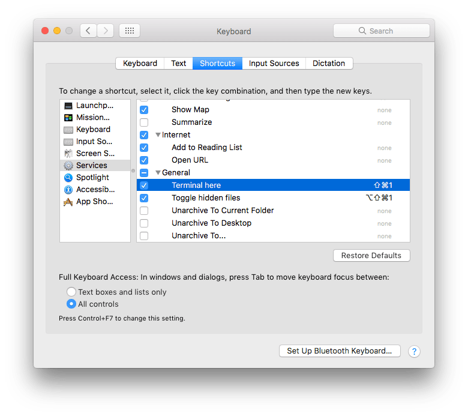

# Services for macOS

Usefull services for macOS to boost your productivity.

Tested for **macOS Sierra**.

### Services:

1. **Terminal here** - to open terminal in current Finder folder
1. **Toggle hidden files** -  to toggle show/hide hidden files :)

After setup you can find them in **Finder** menu - Services

To add shotcuts:

- System Preferences
- Keyboard
- Shotcuts tab
- Services on the left panel
- **General** category
- Activate **Terminal here** and **Toggle hidden files**
- Add shotcuts
- Test them in Finder, maybe you set used shotcuts

Recommend to add **New terminal at Folder** shotcut in **Files and Forlders** cathegory. It is very usefull with **Terminal here** servies.