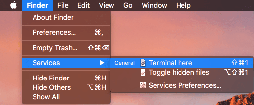
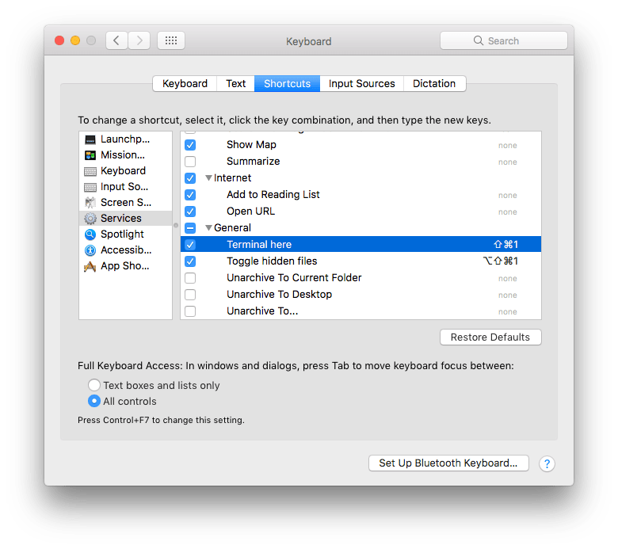

# Services for macOS

Usefull services for macOS to boost your productivity.

- [Availble services](#availble-services)
- [Setup](#setup)
- [Keyboard shortcuts](#keyboard-shortcuts)
- [Recommendation](#recommendation)

## Available services:

1. **Terminal here** - to open terminal in current Finder folder
1. **Toggle hidden files** -  to toggle show/hide hidden files :)

After setup you can find them in **Finder** menu - Services



## Setup

Run line by line in Terminal:

```bash
cd ~/Library/Services/
git init
git remote add origin https://github.com/bonyadmitr/services-macos
git fetch
git checkout -t origin/master
```

Tested for **macOS Sierra**.

## Keyboard shortcuts

To add shortcuts:

- System Preferences
- Keyboard
- Shortcuts tab
- Services on the left panel
- **General** category
- Activate **Terminal here** and **Toggle hidden files**
- Add shortcuts
- Test them in Finder, maybe you set used shortcuts



## Recommendation

Recommend to add **New terminal at Folder** shortcut in **Files and Forlders** cathegory. It is very usefull with **Terminal here** servies.
